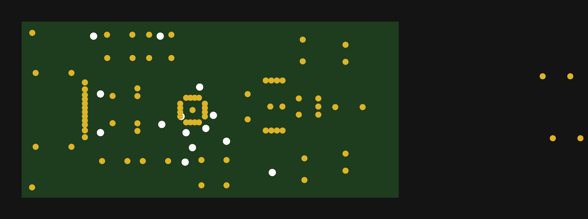
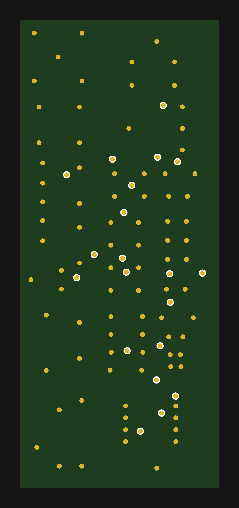

# DSN Parser & Auto-Router

> **Note: This codebase was generated with [Claude Code](https://claude.ai/code) (Anthropic AI).**

A Rust workspace that parses **Spectra DSN files** (PCB design format used by KiCad / FreeRouting),
auto-routes them with a PathFinder congestion-based router, and visualises the result in an egui
desktop GUI.

## Demo

### Charger board — 31 nets, 2 layers (147 wires, 14 vias)


### FastTest board — 20 nets, 2 layers (127 wires, 20 vias)


---

## Features

- **Parser** — full Spectra DSN grammar via [pest](https://pest.rs); handles all real-world
  quirks (`string_quote`, Unicode identifiers, …)
- **PathFinder router** — congestion-based multi-pass algorithm (Ebeling et al., 1995) using
  [`pathfinding`](https://crates.io/crates/pathfinding) for A\*; converges to DRC-legal solutions
  instead of giving up after a fixed number of rip-up passes
- **dsn-viewer GUI** — egui desktop app with pan/zoom, per-layer visibility, ratsnest display,
  live routing progress, and Auto-Route / Clear Routing buttons
- **CLI** — parse, route, and export to DSN or SVG from the command line

## Workspace

```
dsn-parser/   # Core library: DSN parser + typed PCB structs
router/       # PathFinder auto-router (A* + congestion costs)
cli/          # CLI: parse / route / export SVG
gui/          # dsn-viewer: egui desktop visualiser
dsn-files/    # 56 real-world DSN test files (from freerouting project)
```

## Quick start

```bash
# Desktop viewer (opens file dialog)
cargo run -p dsn-viewer

# Pre-load a file
cargo run -p dsn-viewer -- dsn-files/Issue313-FastTest.dsn

# Route and write output DSN
cargo run -p cli -- dsn-files/Issue313-FastTest.dsn -o routed.dsn

# Route and export SVG snapshot
cargo run -p cli -- dsn-files/Issue367-Charger.dsn -o routed.dsn --svg board.svg

# Run all parser tests (56 boards)
cargo test -p dsn-parser
```

## Library usage

```rust
use dsn_parser::parse_file_rust;

let pcb = parse_file_rust("board.dsn")?;
println!("{} layers, {} nets", pcb.structure.layers.len(), pcb.network.nets.len());

// Route it
let wiring = router::route(&pcb, Default::default(), None)?;
println!("{} wires, {} vias", wiring.wires.len(), wiring.vias.len());
```

## Router — how it works

The router implements **PathFinder** (Ebeling et al., 1995), the same algorithm used in
FPGAs (VPR) and academic PCB routers:

1. Every pass re-routes **all** nets using an A\* search whose cell cost is
   `1 + present_factor × occupancy + history`
2. `present_factor` grows each pass — overused cells become increasingly expensive
3. After each pass, `history` is incremented for persistently contested cells
4. The loop stops on the first DRC-legal pass (no cell shared by two nets)

Unlike rip-up-and-reroute, convergence is **guaranteed** when a legal solution exists:
history costs grow unboundedly, forcing nets to eventually find non-overlapping routes.

## Build

```bash
cargo build           # debug
cargo build --release # optimised
cargo test            # all tests
cargo clippy --no-deps
```

## Credits

DSN test files from the [freerouting](https://github.com/freerouting/freerouting) project.
